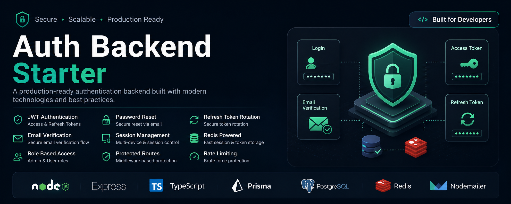
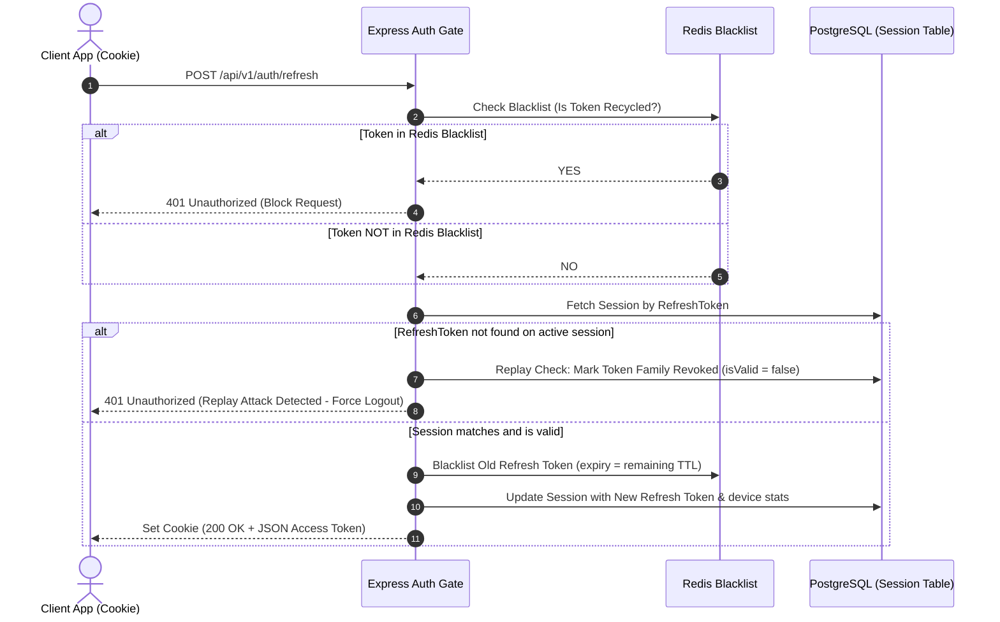

<p align="center">
  
</p>

# 🔐 Reusable SaaS Authentication Starter Template

<p align="center">
  <a href="https://github.com/udinmoInc/api_auth_example">
    
  </a>
  <a href="https://github.com/udinmoInc/api_auth_example/blob/main/LICENSE">
    
  </a>
  
</p>

<p align="center">
  A production-ready, highly flexible authentication boilerplate built with <b>Express.js</b>, <b>TypeScript</b>, <b>Prisma ORM v7</b>, <b>PostgreSQL</b>, and <b>Redis</b>. Designed as an unopinionated starter template, it isolates authentication completely so you can drop it directly into any client, SaaS, or multi-tenant system.
</p>

---

## 🎨 Purpose & Flexibility

This project is built explicitly as a **reusable authentication template**, not a fixed business schema. 

* **No Opinionated Business Models**: You won't find custom e-commerce, blogging, or company-specific structures here.
* **Open for Customization**: Fully MIT licensed, allowing you to adapt it to any architectural requirement (B2B, B2C, single-tenant, or multi-tenant).
* **Extensible & Plugin-Friendly**: Isolates the core JWT token, session management, and authentication guards so you can plug other application modules (subscriptions, workspaces, user dashboards) directly on top.

---

## 🛠️ The Tech Stack

<div align="center">

| Runtime | Framework | Database | Caching / Session | Validation | Security |
| :--- | :--- | :--- | :--- | :--- | :--- |
|  |  |  |  |  |  |
|  | |  | | |  |

</div>

---

## 🚀 Outstanding Security Architecture

* **Double-Layer Stateful JWTs**: Access tokens are signed statelessly but cross-checked against a database `Session` pool on every request, allowing instantaneous remote revokes and password updates.
* **Token Rotation (RTR)**: Generates a brand new refresh token with every renew request. Prevents session theft and man-in-the-middle attacks.
* **Grace-Period Race Mitigation**: Implements a 15-second cache grace period for rotated refresh tokens to prevent parallel client network requests or double-clicks from throwing accidental replay attack logouts.
* **Secure Cookie Storage**: Refresh tokens are stored in browser cookies under strict `httpOnly`, `sameSite: 'strict'`, and `secure: true` (in production) flags, shielding against XSS and CSRF.
* **Aggressive IP Rate-Limiting**: Global request limiting combined with strict authentication endpoint limits (10 attempts per 15 minutes) to neutralize brute-force attacks.
* **Modern Prisma 7 Driver Adapters**: Integrates the native `@prisma/adapter-pg` driver adapter and connection pool, eliminating heavy database binaries and reducing runtime container memory footprint.

---

## 📉 Token Rotation Workflow



---

## 📁 Repository Layout

```text
src/
├── config/           # Environment parsing and type-safety validations (Zod)
├── constants/        # Global token lifespans and auth rates
├── lib/              # Client SDK connectors (Prisma client & Redis client)
├── middleware/       # Custom filters (Auth guard, request tracer, rate limits)
├── modules/          # Domain-driven slices
│   └── auth/         # Complete controller-service-repository auth slice
├── routes/           # Versioned API path endpoints (/api/v1)
├── services/         # Mailer and global helper wrappers
├── types/            # TypeScript request overrides
└── utils/            # Winston logging and standardized REST payloads
```

---

## ⚙️ Quick Setup Guide

### 1. Initialize Configuration
Copy the template configuration file:
```bash
cp .env.example .env
```
Update `.env` with your Postgres connection strings, Redis URL, and SMTP details.

### 2. Launch Local Caching & DB
Deploy lightweight PostgreSQL and Redis databases using Docker:
```bash
docker-compose up -d postgres_db redis_cache
```

### 3. Generate Database Client & Migrations
Compile the Prisma ORM v7 client engine and run relational migrations:
```bash
npm install
npm run prisma:generate
npm run prisma:migrate
```

### 4. Start Hot-Reloading Development Server
```bash
npm run dev
```

The authentication backend will boot and listen for requests at **`http://localhost:5000/api/v1`**.

---

## 📡 API Reference Sandbox

Use the preconfigured [api.http](./api.http) requests dashboard (fully compatible with VS Code's **REST Client** extension) to execute test runs directly inside your editor.

<details>
<summary><b>🔍 Expand endpoints checklist</b></summary>
<br/>

| Method | Endpoint | Authorization | Description |
| :--- | :--- | :--- | :--- |
| `POST` | `/auth/register` | Public | Register new user & profile |
| `POST` | `/auth/login` | Public | Authenticate user & issue tokens |
| `POST` | `/auth/refresh` | Public | Rotate access & refresh tokens |
| `POST` | `/auth/logout` | Public | Revoke session & blacklist token |
| `GET` | `/auth/verify-email` | Public | Verify user email address |
| `POST` | `/auth/forgot-password`| Public | Request password reset email |
| `POST` | `/auth/reset-password` | Public | Reset password using token |
| `GET` | `/auth/sessions` | Bearer Access | List active user device sessions |
| `DELETE`| `/auth/sessions/:sessionId`| Bearer Access | Revoke a specific active session |
| `GET` | `/health` | Public | System uptime & health check |

</details>

---

## 📄 License
This repository is open-source and available under the **MIT License**. Feel free to fork, customize, and extend it for any SaaS or client project. For details, see the [LICENSE](./LICENSE) file.

Copyright (c) 2026 APIOrbit